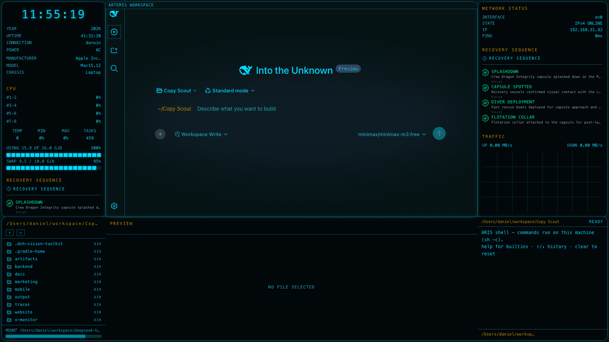

# dsh-edex-artemis-ui

**Artemis II Mission Control Theme** — a mission-control-inspired eDEX-UI shell variant for the
DeepSeek Harness Web GUI. Based on the [Artemis II Tracker](https://artemis.cdnspace.ca) live mission control dashboard.



## Theme

- **Accent**: Neon cyan `#00D9FF` on deep navy `#020608` / `#0a1628`
- **Frame border**: 1px solid `#06465A` with 14px rounded corners and subtle cyan glow
- **Single-panel dashboard**: No per-card sub-borders — clean, continuous card surfaces
- **Semantic colors**: Success `#00F59A`, Warning `#C78C00`, Error `#C52B3F`, Info `#00D9FF`
- **Workspace**: Background matches the panel surface, framed with `ARTEMIS WORKSPACE` title bar

## Featured Widget

**RECOVERY SEQUENCE TIMELINE** — replaces the WORLD VIEW globe with a vertical mission recovery timeline showing splashdown steps, status indicators (green for completed, cyan for active), descriptions, and timestamps.

## Widget Reconciliation

| Reference Widget | eDEX Slot | Match |
|---|---|---|
| RECOVERY SEQUENCE | processes | high |
| STATUS INDICATORS | network-status | partial |
| CREW INFO | info | partial |

## Features

- **Left bar**: System overview (CPU, memory, swap, platform info) + RECOVERY SEQUENCE timeline
- **Right bar**: Network status + RECOVERY SEQUENCE timeline (featured) + Traffic chart
- **Bottom panel**: Filesystem browser (DIR), file preview/editor (PREVIEW), host terminal (TERMINAL)
- **Terminal-styled composer**: Flattened input capsule, block caret, `~/<workspace>` path prompt
- **Workspace-follow**: DIR panel and prompt track the active conversation's workspace

## Installation

```sh
pnpm dsh plugin --profile web add @danielng23/dsh-edex-artemis-ui
pnpm dsh web
```

## Development

See [LOCAL_DEVELOPMENT.md](LOCAL_DEVELOPMENT.md) for the full build, install, and iteration workflow.

## License

MIT